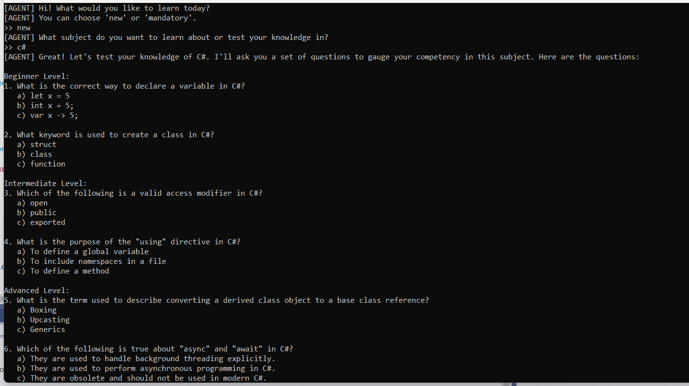
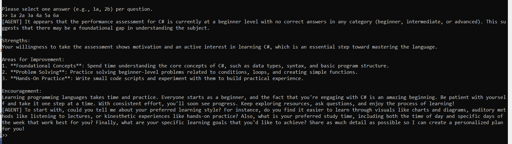
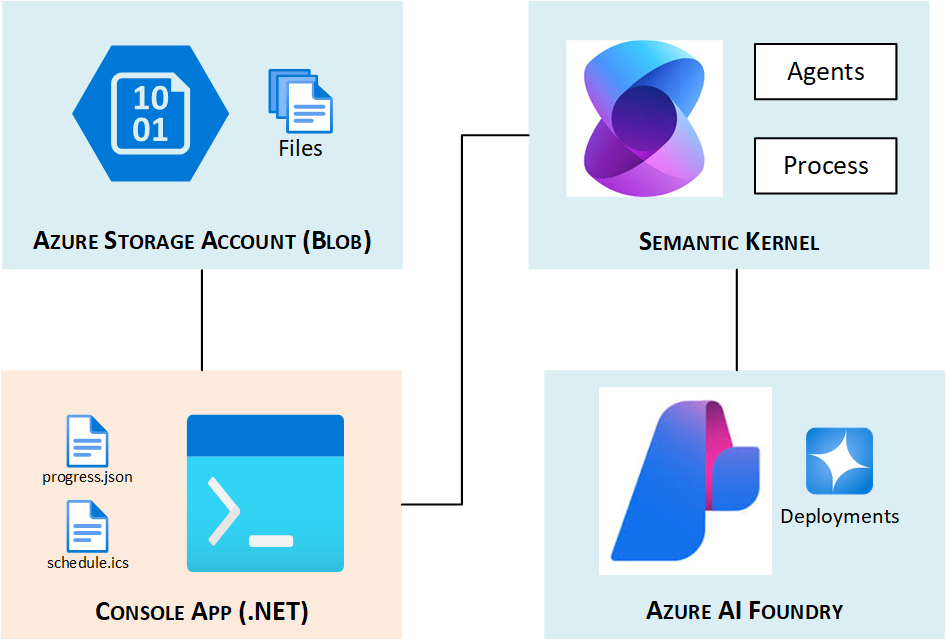
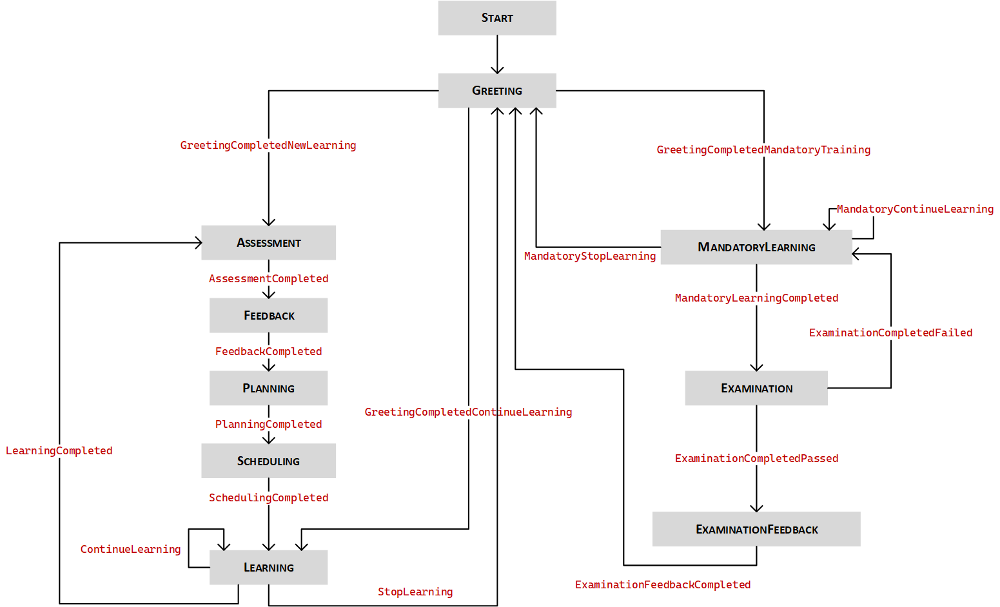

# Team Name
AgenticMinds

## Overview
Welcome to our project submission for the Agentic AI incubation! This repository contains the code and documentation for our innovative solution, the *AgenticMinds Personalised Learning Assistant*. Developed by the AgenticMinds team, this project aims to enhance personalised learning experiences by leveraging AI to create tailored educational support systems.

## Explanation
The *Personalised Learning Assistant* developed by the AgenticMinds team functions as a multi-step, agent-driven learning assistant that adapts dynamically to each student's needs. The system operates through a series of process steps, each responsible for a distinct phase of the educational journey:

- Initial assessment of the student's knowledge and preferences  
- Collaborative planning of a personalised learning path  
- Delivery of structured and optional content with interactive tutoring  
- Ongoing progress tracking and adaptive scheduling  
- Feedback collection and formal evaluation through exams  

This modular approach allows the platform to simulate a real-life teaching assistant, providing targeted instruction, checking understanding, and refining the plan as the learner progresses.

## Intent
The primary intent of our project is to provide adaptive, AI-driven learning journeys that meet individual needs while remaining scalable for institutional use. We aim to improve student engagement, reduce instructional gaps, and enable educators to deliver data-informed personalised support at scale.

## Use Case
Assigned Industry Use Case:  
**Personalised Learning Assistant**

The *Personalised Learning Assistant* by the AgenticMinds team is designed for students, educators, and academic institutions aiming to provide personalised and adaptive learning experiences. It supports use cases such as:

- **Scenario 1**: A student receives a personalised lesson plan and is guided step-by-step through interactive resources, supplemented by regular progress checks and feedback.  
- **Scenario 2**: Educators use the system to initiate student journeys, track engagement and assessment results, and review feedback reports to fine-tune classroom instruction.  
- **Scenario 3**: An institution integrates the *Personalised Learning Assistant* into their curriculum delivery platform to standardise learning plans while offering personalisation at scale.

By combining adaptive planning, resource curation, interactive learning, and scheduling, the *Personalised Learning Assistant* addresses both learner autonomy and institutional requirements for performance tracking.

## Contributors
This project was developed by a dedicated team of contributors:
- **Alagarsamy, Mahalakshmi**: Developer
- **Avery, Padget**: Developer
- **Baran, Rozerin**: Developer
- **Pizzi, David**: Developer

## Images
**Screenshot 1:** The *Personalised Learning Assistant* in action, guiding a student through a learning resource.

**Screenshot 2:** The *Personalised Learning Assistant* providing feedback and assessment results to the student.


## Implementation

### Solution Architecture

The *Personalised Learning Assistant* solution architecture is designed to provide a modular, scalable, and AI-driven learning platform. The architecture consists of the following key components:

1. **Agents Layer**:
   - Specialised agents such as LearningAgent, AssessmentAgent, SchedulingAgent, and others handle specific tasks like tutoring, assessments, scheduling, and feedback collection.  
   - These agents are built using ChatCompletionAgent and leverage Azure OpenAI services for natural language processing.

2. **Process Steps Layer**:
   - The system operates through a series of process steps, each implemented as a KernelProcessStep.  
   - These steps include PlanningStep, LearningStep, SchedulingStep, and others, which manage distinct phases of the learning journey.

3. **State Management**:
   - The ProgressStorage class is used to persist user progress in a JSON file (progress.json), ensuring continuity across sessions.  
   - Each process step maintains its state (e.g., ChatLogState) to track user interactions and progress.

4. **Integration with Microsoft Semantic Kernel**:
   - The Semantic Kernel powers the conversational and decision-making capabilities of the system.  
   - Kernel functions are used to implement process steps, enabling seamless integration with AI-driven workflows.

5. **External Systems Integration**:
   - The architecture supports integration with external data sources, such as Azure Blob Storage, to retrieve learning resources.  
   - Study schedules are generated in iCalendar (.ics) format for easy integration with calendar applications like Google Calendar and Outlook.

6. **User Interaction**:
   - Users interact with the system through conversational interfaces powered by agents.  
   - The system dynamically adapts to user preferences, progress, and feedback to provide a personalised learning experience.

The architecture diagram below visually represents these components and their interactions, highlighting the modular design and seamless integration of agents, process steps, and external systems.



### Technical Details

#### Agents

The *Personalised Learning Assistant* includes several specialised agents, each designed to handle specific tasks and interactions:

- **AssessmentAgent**
  - *Purpose*: Conducts knowledge assessments to evaluate the student's current competency level.
  - *Functionality*
    - Asks a set of multiple-choice questions categorised into beginner, intermediate, and advanced levels.
    - Generates JSON-based assessment results, including scores and subject details.
    - Helps determine the student's starting point in the learning plan.

- **FeedbackAgent**
  - *Purpose*: Collects and processes feedback from students to improve the learning experience.
  - *Functionality*
    - Gathers feedback on resources, agents, and overall learning experience.
    - Provides constructive feedback on assessment results, highlighting strengths and areas for improvement.

- **MaterialResourceAgent**
  - *Purpose*: Manages and provides access to learning materials.
  - *Functionality*
    - Retrieves and organises resources for the learning plan.
    - Ensures resources are up to date and relevant.

- **PreferencePlanningAgent**
  - *Purpose*: Captures learner preferences to inform planning.
  - *Functionality*
    - Asks students about their preferred learning style, study times, and goals.
    - Summarises preferences in JSON format for use during planning.

- **SchedulingAgent**
  - *Purpose*: Manages the student's study schedule and tracks their progress.
  - *Functionality*
    - Develops a study schedule based on the student's availability and learning goals.
    - Generates schedules in iCalendar (.ics) format for integration with calendar applications.
    - Dynamically updates schedules based on performance and feedback.

- **LearningAgent**
  - *Purpose*: Acts as a tutor for the student, guiding them through learning resources.
  - *Functionality*
    - Encourages students to ask questions and clarify doubts.
    - Motivates students by acknowledging their progress.
    - Provides URLs to resources and checks the student's understanding after completion.
    - Allows students to decide whether to continue or stop learning after each resource.

- **MandatoryLearningAgent**
  - *Purpose*: Provides mandatory learning resources and ensures their completion.
  - *Functionality*
    - Retrieves resources from Azure Blob Storage.
    - Downloads resources locally for the student.
    - Tutors the student on mandatory resources, similar to the LearningAgent.
    - Extracts content from PDF resources for review.

- **ExaminationAgent**
  - *Purpose*: Administers exams to evaluate the student's mastery of the subject.
  - *Functionality*
    - Creates and grades exams based on the learning plan.
    - Provides detailed feedback on exam performance.
    - Determines whether the student has passed or needs to revisit learning materials.

These agents are built using `ChatCompletionAgent` and are integrated with Azure OpenAI services for natural language processing. Each agent is configured with specific instructions to ensure a seamless and personalised user experience.

#### Process Steps

The *Personalised Learning Assistant* project includes several process steps, each responsible for managing specific parts of the learning workflow:

- **GreetingStep**
  - *Purpose*: Welcomes users and handles resumption or initiation of learning sessions.
  - *Functionality*
    - Resumes previous sessions or starts a new learning journey.
    - Deletes old progress if the user opts for a fresh start.
 
- **AssessmentStep**
  - *Purpose*: Conducts an assessment to evaluate the user's current knowledge level.
  - *Functionality*
    - Asks a series of questions to determine the user's competency.
    - Generates assessment results, which are used to create a personalised learning plan.

- **FeedbackStep**
  - *Purpose*: Collects feedback from the user after completing assessments.
  - *Functionality*
    - Summarises assessment results.
    - Gathers user feedback to improve the learning experience.

- **PlanningStep**
  - *Purpose*: Facilitates planning by interacting with the user to gather preferences and generate a learning plan.
  - *Functionality*
    - Engages in a back-and-forth chat to understand user preferences.
    - Generates a personalised learning plan based on assessment results.

- **SchedulingStep**
   - *Purpose*: Creates a detailed study schedule for the user.
   - *Functionality*
     - Generates a study schedule in iCalendar (.ics) format based on learning preferences and plans.
     - Allows users to import the schedule into calendar applications.
     - Tracks scheduling progress and ensures alignment with learning goals.

- **LearningStep**
  - *Purpose*: Guides the user through learning resources and tracks completion.
  - *Functionality*
    - Provides resources for the user to study.
    - Tracks progress and allows the user to continue or stop learning.

- **MandatoryLearningStep**
  - *Purpose*: Guides the user through mandatory learning resources.
  - *Functionality*
    - Provides mandatory resources for the user to study.
    - Ensures that all mandatory resources are completed before proceeding.

- **ExaminationStep**
  - *Purpose*: Manages mandatory examinations for users.
  - *Functionality*
    - Handles state management for mandatory exams.
    - Prepares the system for examination-related tasks.

- **ExaminationStepFeedback**:
  - *Purpose*: Collects feedback on the examination process and results.
  - *Functionality*:
    - Summarizes examination results, including resource IDs, titles, and scores.
    - Engages in a back-and-forth chat with the user to gather feedback on the examination experience.

Each process step is implemented as a KernelProcessStep and integrates seamlessly with the agents to provide a cohesive learning experience.
Below is a diagram of the process steps and their interactions:



### Setup

The following steps are required to set up the AgenticMinds project in your local or cloud environment:

#### 1. Create Azure OpenAI Resource

- Go to the Azure Portal and create a new **Azure OpenAI** resource.
- Navigate to the **Deployments** section and deploy a model with the following configuration:
  - Model: `gpt-4o`
  - Deployment name: `gpt-4o`

Take note of:
- Endpoint URL (e.g., `https://<your-resource-name>.openai.azure.com/`)
- API key
- Deployment name (`gpt-4o`)

#### 2. Set Up Azure Storage Account

- In the Azure Portal, create a new **Storage Account** (Standard performance, LRS redundancy is sufficient).
- Within the storage account, create a **Blob container** named `resources`.
- Upload all mandatory learning materials from your local directory:
  - `Assets/mandatory/*.pdf` (or equivalent sample content)
- Ensure the container access level is set to **private**.

Take note of:
- Storage account name
- Blob container name (`resources`)
- Storage account key
- Blob service endpoint URL (e.g., `https://<storage-account>.blob.core.windows.net/`)

#### 3. Configure User Secrets

To securely store configuration details:

- Right-click the `AgenticMinds` project in Visual Studio and select **Manage User Secrets**.
- Paste the following JSON, replacing placeholder values with those from your Azure portal:

```json
{
  "endpoint": "https://<your-openai-resource>.openai.azure.com/",
  "apiKey": "<your-openai-api-key>",
  "preferencePlanningAgent": "gpt-4o",
  "assessmentAgent": "gpt-4o",
  "schedulingAgent": "gpt-4o",
  "FeedbackAgent": "gpt-4o",
  "tutorAgent": "gpt-4o",
  "examinationAgent": "gpt-4o",
  "materialResourceAgent": "gpt-4o",
  "mandatoryLearningAgent": "gpt-4o",
  "resourceContainerName": "resources",
  "AzureBlobServiceEndpoint": "https://<your-storage-account>.blob.core.windows.net/",
  "AzureBlobAccountKey": "<your-storage-account-key>",
  "AzureBlobStorageAccountName": "<your-storage-account-name>"
}
```
## Additional Information

### Known Issues
- Due to lack of time, some improvements in the agents instructions could have been done more effectively to fine tune agent behaviours. For example, the examination agent does not yet provide a detailed breakdown of scores by question. 

### Future Plans
1. **Architecture and API Design**  
   The AgenticMinds solution will be modularised into distinct front end and back end components. A comprehensive API layer will be exposed to allow seamless integration with a variety of platforms and interfaces. These APIs will enable consumption by:
   - Web applications for desktop and browser-based learners
   - Mobile applications to support on-the-go access and progress tracking
   - Microsoft 365 apps such as Microsoft Teams, as well as Power Platform tools including Power Virtual Agents and Power Automate bots

2. **External System Integration**  
   The API will support inbound integration with third-party systems to retrieve mandatory training metadata. This includes fetching structured lists of required training modules, associated resources, and status updates from external learning management systems (LMS) or compliance platforms.

3. **Adviser Agent Capabilities**  
   A planned AdviserAgent will provide advanced personalisation support. This agent will:
   - Predict and recommend new learning resources tailored to the learner's progress history and quiz results
   - Analyse assessment performance to infer learning preferences and recommend adjustments to content delivery (e.g., visual, auditory, or interactive modalities)

4. **Deployment Strategy and Scalability**  
   The current version of AgenticMinds operates as a local deployment. Future iterations are intended to support cloud-native scalability and high availability using distributed runtime platforms such as:
   - **Microsoft Orleans** for actor-based, fault-tolerant, stateful processing
   - **Dapr (Distributed Application Runtime)** to enable loosely coupled microservices and sidecar capabilities  
   For architectural guidance, see:  
   https://learn.microsoft.com/en-us/semantic-kernel/frameworks/process/process-deployment

5. **Operational Best Practices**  
   To ensure performance and maintainability as usage grows, the solution will adopt best practices outlined in the Semantic Kernel process framework:  
   https://learn.microsoft.com/en-us/semantic-kernel/frameworks/process/process-best-practices

   These include:
   - Implementing performance telemetry across all KernelProcessSteps to track execution duration, success/failure rates, and decision quality
   - Continuously analysing telemetry data to identify performance bottlenecks and optimise step logic
   - Setting up alerts and dashboards to ensure proactive monitoring and timely interventions when needed
